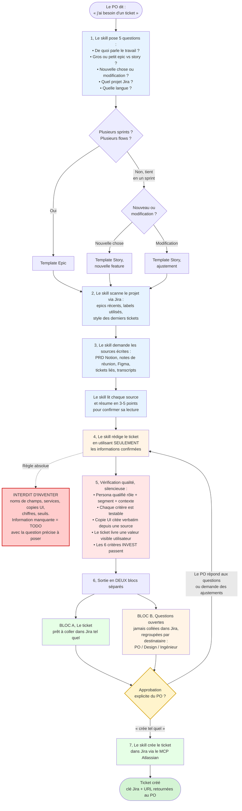

# po: Plugin Claude Code pour Product Owners

Un plugin Claude Code qui regroupe **deux skills** au service des Product Owners :

- **`/po:jira-ticket`**: rédige des tickets Jira de qualité (epics, user stories / nouvelles features, ajustements) avec des personas qualifiés, des critères d'acceptabilité testables, des copies UI verbatim, et toutes les métadonnées requises. Tire son contexte des sources MCP connectées (Jira, Notion, Confluence, Figma) plutôt que de présumer quoi que ce soit. Crée le ticket dans Jira sur approbation explicite.
- **`/po:check`**: audite un ticket Jira existant contre le même contrat de qualité. Lit le ticket via `Atlassian:getJiraIssue`, exécute les vérifications structurelles + INVEST (story) ou Validation epic (epic), retourne un rapport pass/fail avec corrections concrètes, et peut appliquer les fixes via `Atlassian:editJiraIssue` (avec approbation par fix).

---

## Le flow complet du skill



### Légende des couleurs

- 🔵 **Bleu**, phase de cadrage / contexte (le skill pose des questions, scanne le projet, lit les sources).
- 🟡 **Beige**, phase de rédaction.
- 🔴 **Rouge** (callout en pointillé), la règle anti-fabrication. La seule règle qui ne se contourne pas.
- 🌸 **Rose pâle**, la vérification qualité, qui tourne en silence avant la livraison.
- 🟢 **Vert**, ce qui est livré (Bloc A) ou créé dans Jira.
- 🟨 **Jaune**, la gate d'approbation. Tant que le PO ne dit pas *« crée tel quel »*, rien n'est créé dans Jira.

---

## Structure du plugin

```
po/
├── .claude-plugin/
│   └── plugin.json                       # manifest du plugin (name: po)
├── skills/
│   ├── jira-ticket/                      # /po:jira-ticket
│   │   ├── SKILL.md                      # entrypoint du skill
│   │   ├── templates/
│   │   │   ├── epic.md                   # 8 sections de Bloc A
│   │   │   ├── new-feature.md            # 6 sections de Bloc A
│   │   │   └── adjustment.md             # 6 sections de Bloc A
│   │   ├── examples/
│   │   │   ├── epic-example.md           # exemple annoté, domaine neutre
│   │   │   ├── new-feature-example.md
│   │   │   └── adjustment-example.md
│   │   └── references/
│   │       ├── quality.md                # Section 1 : 16 règles. Section 2 : INVEST.
│   │       └── mcp-handling.md           # Section 1 : appels MCP. Section 2 : sécurité.
│   └── check/                            # /po:check
│       └── SKILL.md                      # 11 checks pour epic, 10 pour story
├── evals/                                # tests (hors runtime du plugin)
│   ├── README.md
│   ├── evals.json                        # 13 cas de test
│   └── rubric.md                         # critères pass/fail humains
└── README.md                             # ce fichier
```

---

## Installation

### Pré-requis

- **Atlassian MCP**: requis pour scanner le projet (Étape 2 de `/po:jira-ticket`), créer les tickets (Étape 8), lire les tickets pour audit (`/po:check`), et appliquer les fixes (`/po:check` apply-fix).
- **Notion MCP** *(optionnel mais recommandé)*, pour les PRD et notes de réunion référencés en source de vérité.
- **Confluence MCP** *(optionnel)*, même idée, pour les specs produit.
- **Figma**: les liens sont préservés dans le ticket ; pas de fetch (le contenu Figma n'est pas extrait).

### Test local

Charge le plugin sans installation pour développement :

```bash
claude --plugin-dir /chemin/vers/po
```

Les skills deviennent invocables comme `/po:jira-ticket` et `/po:check`. `/reload-plugins` recharge après chaque édition.

### Installation pour l'équipe

1. Publie le plugin dans une marketplace (la tienne ou la marketplace officielle Anthropic).
2. Les membres de l'équipe installent via `/plugin install po@ta-marketplace`.
3. Versionné via le champ `version` dans `plugin.json`.

Voir la [doc plugins Claude](https://code.claude.com/docs/en/plugins) et la [doc marketplaces](https://code.claude.com/docs/en/plugin-marketplaces).

---

## Comment l'utiliser: exemples concrets

### Exemple 1: Rédiger un epic

**Invocation :**

```
/po:jira-ticket

J'ai besoin d'un epic pour notre nouvelle initiative de gestion d'équipe self-service.
Les admins d'équipe doivent pouvoir inviter, modifier les rôles, et retirer des
membres sans passer par le support. Couvre 2-3 sprints.
```

**Le skill répond avec** : 5 questions de cadrage (subject confirmé, sizing, type, projet, langue), puis sur la deuxième réponse → scan du projet PROJ via Jira → demande les sources (PRD, Figma) → rédige l'epic en Bloc A + Bloc B.

**Bloc A (extrait) :**

```markdown
## Summary
Self-service team management, invitations, rôles, retraits

## Objectif
Permettre à un admin d'équipe d'inviter, modifier le rôle, et retirer un
membre de son organisation sans ouvrir de ticket support, en moins de 2
minutes par opération.

## Contexte
État du monde. Aujourd'hui, l'ajout, la modification de rôle, et le retrait
d'un membre passent par un ticket support traité manuellement (délai moyen
1-3 jours ouvrables). Le modèle d'organisation et l'enum de rôles existent
déjà côté backend (PROJ-1100), mais aucune interface admin ne les expose.

Pourquoi maintenant. L'initiative « Reduce time-to-value for new customers »
identifie le délai d'intégration des membres comme un des trois principaux
freins à l'activation d'un nouveau client B2B...

## Acceptance criteria
- Un admin peut inviter un nouveau membre par courriel et lui assigner un rôle.
- Un admin peut modifier le rôle d'un membre existant à tout moment.
- Un admin peut retirer un membre, et celui-ci perd ses accès dans les 60s.
- L'historique des changements est consultable sur les 12 derniers mois.

## Non-inclus
- Single Sign-On (SSO), couvert par une autre initiative, hors-scope.
- Gestion des invitations en bulk depuis CSV, reportée (PROJ-1300).
- Personnalisation par l'admin de la copie du courriel d'invitation (PROJ-1305).
- Modification du modèle de rôles existant, la version actuelle reste en place.

## Stories enfants
- [ ] Modal Inviter un membre, Sprint 1
- [ ] Liste des membres avec rôle, Sprint 1
- [ ] Modifier le rôle d'un membre, Sprint 2
- [ ] Retirer un membre, Sprint 2
- [ ] Historique des changements, Sprint 3

## Details
- Project: PROJ
- Issue type: Epic
- Parent: Initiative « Reduce time-to-value for new customers »
- Labels: Team, Self-service
- Priority: High
- Time-window estimate: Q3 (≈ 8-10 sprints)
```

**Bloc B (extrait) :**

```
Pour la PO
- Q1 (débloque AC bullet 4, historique 12 mois) Pourquoi 12 mois ? Y a-t-il
  une exigence légale (RGPD, audit) ou une décision produit ?
- Q2 (débloque Non-inclus, notifications membres) Un membre dont le rôle
  change reçoit-il une notification courriel automatique ? Si oui, c'est
  une 6e child story.

Pour l'équipe support / opérations
- Q3 (débloque Objectif, métrique de succès) Quelle réduction de tickets
  support attendez-vous ?

Validation epic, flags surfacés
- Pourquoi maintenant ?  ✅
- Découpage              ⚠️  Voir Q2
- Edges du périmètre     ✅
- Mesurabilité           ⚠️  Voir Q3
```

Sur réponse aux questions → Bloc B se vide → approbation explicite → `Atlassian:createJiraIssue` → clé + URL retournées.

### Exemple 2: Rédiger une user story (nouvelle feature, child de l'epic ci-dessus)

**Invocation :**

```
/po:jira-ticket

Maintenant je veux drafter la première story enfant de l'epic PROJ-1050 :
le modal qui permet à l'admin d'inviter un nouveau membre par courriel.
```

**Le skill répond avec** : 5 questions de cadrage → confirmation que c'est sprint-sized + new feature + parent epic = PROJ-1050 → scan du projet PROJ → demande des sources (PRD §2 sur l'invitation, Figma node-id) → rédige la story en Bloc A + Bloc B.

**Bloc A (extrait) :**

```markdown
## Summary
Modal Inviter un membre

## Contexte
En tant qu'admin d'une équipe de 10+ membres, lorsque je dois ajouter un
nouveau collaborateur sans passer par le support, je souhaite l'inviter par
courriel avec un rôle pré-sélectionné afin que mon équipe puisse intégrer
la personne en quelques minutes plutôt qu'en quelques jours.

**Contraintes**
- L'envoi de courriels passe par le vendeur d'envoi sous contrat (voir PROJ-1100).
- L'invitation n'apparaît dans la liste qu'après confirmation d'envoi par le vendeur.

## Acceptance criteria

**Préconditions**
- L'admin est authentifié.
- L'admin a la permission « inviter un membre » (introduite dans PROJ-1100).
- La liste des membres est visible dans la section « Équipe ».

**Scénarios**

**Scénario, Invitation envoyée à une adresse valide**
- Étant donné qu'un admin a ouvert le modal
- Quand il saisit une adresse courriel valide, sélectionne « Membre standard »,
  et clique sur « Envoyer l'invitation »
- Alors le bouton affiche un spinner et est désactivé
- Et le système met le courriel en file d'envoi
- Et au retour du vendeur, le modal de confirmation s'affiche (voir PROJ-1201)

**Scénario, Adresse courriel invalide**
- Étant donné qu'un admin a saisi une adresse mal formée
- Quand il clique sur « Envoyer l'invitation »
- Alors le modal reste ouvert
- Et le message « Adresse courriel invalide. Veuillez vérifier l'orthographe. »
  s'affiche sous le champ courriel (verbatim, source : PO)
- Et aucun courriel n'est mis en file d'envoi

**Scénario, Échec côté vendeur d'envoi**
- Étant donné qu'un admin a cliqué sur « Envoyer l'invitation »
- Quand le vendeur retourne une erreur
- Alors le message « Échec de l'envoi. Veuillez réessayer. » s'affiche

**Scénario, Annulation**
- Étant donné qu'un admin a ouvert le modal
- Quand il clique sur « Annuler »
- Alors le modal se ferme et aucun appel n'est fait au vendeur

**Règles & contraintes**
- Titre du modal : « Inviter un membre » (verbatim, Notion PRD §2.1)
- Rôles offerts : « Admin », « Membre standard », « Lecture seule » (PROJ-1100)
- Une seule adresse courriel par invitation (multi-saisie hors-scope, voir Non-inclus)
- Boutons : « Annuler » (secondaire), « Envoyer l'invitation » (primaire)

**Effets de bord système**
- À la confirmation du vendeur, l'invitation est créée avec le statut « En attente »
  (séquence implémentée dans PROJ-1100, l'engineer reprend le pattern existant).
- Voir Q3 en Bloc B pour les détails exacts (table, événements émis).

## Design
[Screenshot embedded]
https://www.figma.com/design/<file>/Team-Management?m=auto&node-id=<id>

## Non-inclus
- Invitation multiple depuis CSV, voir PROJ-1300, à drafter séparément.
- Personnalisation de la copie du courriel, hors-scope (voir PROJ-1305).
- Suivi en temps réel de l'ouverture du courriel par l'invité, hors-scope.

## Details
- Project: PROJ
- Issue type: Task
- Parent epic: PROJ-1050
- Labels: Team, Features
- Priority: Medium
- Assignee: [Engineer name]
- Reporter: [PO name]
- Sprint: Sprint 1 of the 2-sprint plan
- Story points: 2
- Linked tickets: Blocks PROJ-1201, Relates to PROJ-1100
```

**Bloc B (extrait) :**

```
Pour la PO
- Q1 (débloque Règles & contraintes, durée d'expiration)
  Le lien d'inscription est valide combien de temps ? 7 jours est-il
  configurable par l'admin ou fixe ?

Pour Ingénieur
- Q3 (débloque Effets de bord système)
  Quels effets observables côté backend à la confirmation de mise en file
  par le vendeur ? Pour chaque effet : sa nature, où il s'observe, comment
  le vérifier. Citer depuis le code ou la doc.

Validation INVEST, flags surfacés
- I, Independent     ✅  Livrable seul, bloque PROJ-1201.
- N, Negotiable      ✅  AC décrit les outcomes, pas l'implémentation.
- V, Valuable        ✅  Admin invite par lui-même, sans support.
- E, Estimable       ✅  2 points (Q3 ne bloque pas, le pattern existe).
- S, Small           ✅  Une seule capacité (invitation simple).
- T, Testable        ✅  Quatre scénarios GWT, copie UI verbatim sourcée.
```

Sur réponse à Q1 et Q3 → Bloc B se vide → approbation explicite → ticket créé dans Jira → clé `PROJ-1051` + URL retournées.

### Exemple 3: Auditer un ticket existant

**Invocation :**

```
/po:check PROJ-2368
```

**Le skill répond avec** : fetch du ticket via Jira → identification du type (Epic) → exécution des 11 checks → rapport en Bloc A + Bloc B.

**Bloc A (extrait du rapport d'audit) :**

```markdown
## Audit: PROJ-2368: Système de paies

Type detected: Epic
Overall status: Needs work ⚠️

### Passes
- ✅ A1 Summary, noun phrase action-neutre.
- ✅ A2 Objectif, outcome observable nommé.
- ✅ A3 Contexte, état du monde + segments affectés présents.
- ✅ A5 Design général linked, lien Figma fourni.
- ✅ A7 Stories enfants linked, 5 children, vertical slices.

### Flags
- ⚠️ A4 Acceptance criteria, section sparse ; le Contexte fait figure d'AC.
  Suggested fix: extraire 3-6 bullets observables et mesurables depuis le
  Contexte vers la section AC dédiée.
- ⚠️ A6 Non-inclus, section absente. C'est le gap le plus commun sur les
  epics réels. Suggested fix: lister explicitement les capacités adjacentes
  hors-scope (ex. legacy flow X reste tel quel, intégration SSO différée).
- ⚠️ A11 Validation epic, Mesurabilité non vérifiable sans cible chiffrée.
  Suggested fix: ajouter une métrique cible dans Objectif ou AC.

### Hard fails
(aucun)
```

**Bloc B :**

```
Pour la PO
- Q1 (débloque A6 Non-inclus) Quelles capacités adjacentes voulez-vous
  exclure explicitement ? Les engineers risquent d'over-interpréter sans
  cette liste.
- Q2 (débloque A11 Mesurabilité) Quelle est la cible chiffrée de succès
  pour cet epic ?
```

Le rapport est paste-ready comme commentaire Jira. Optionnellement, le PO peut demander au skill d'appliquer les fixes, un par un, avec approbation explicite par fix, via `Atlassian:editJiraIssue`.

---

## Tester le plugin

Avant de déployer un changement à l'équipe :

1. Exécute la suite d'evals (`evals/evals.json`), 13 cas couvrant les happy paths (epic, new feature, adjustment), les edge cases (type ambigu, Figma manquant, gestion de la langue, AC vague), et les concerns sécurité (injection dans les sources fetched).
2. Vérifie chaque cas contre le rubric (`evals/rubric.md`).
3. Vise au moins 11/13 cases qui passent et zéro échec sur le rubric universel.

Voir `evals/README.md` pour le processus complet.

---

## Contribuer

Les changements au plugin passent par une PR :

1. Branche depuis `main`.
2. Édite `skills/<skill>/SKILL.md`, les templates, les references, ou les examples.
3. Re-roule les evals et colle les résultats dans la description de la PR.
4. Bump le `version` dans `.claude-plugin/plugin.json` si tu veux que les utilisateurs reçoivent une mise à jour.
5. Une review d'un autre PO requise avant merge.
6. Après merge, post un résumé une-ligne dans le canal d'équipe.

---

## Crédits & ressources

- Hiérarchie Atlassian (theme / initiative / epic / story / task) basée sur [atlassian.com/agile/project-management/epics-stories-themes](https://www.atlassian.com/agile/project-management/epics-stories-themes).
- Critères INVEST classiques d'agile.
- Format Given-When-Then (Étant donné / Quand / Alors) standard BDD.
